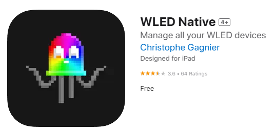
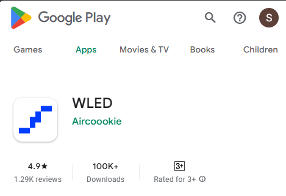

## Overview

Please follow one of the guides below to configure WLED.

### Download and Install mobile app

=== "Apple"

    1. Go to the app store and download the WLED app
	    - [WLED Native on the App Store (apple.com)](https://apps.apple.com/us/app/wled-native/id6446207239)  
    <figure markdown="span">
     {align=left}
    </figure>	
    

=== "Android"

    1. Go to the app store and download the WLED app 
	    - [WLED – Apps on Google Play](https://play.google.com/store/apps/details?id=com.aircoookie.WLED&hl=en_AU&pli=1)
    <figure markdown="span">
     {align=left}
    </figure>
    1. Once downloaded, open the app and press the :material-plus: icon at the top right

